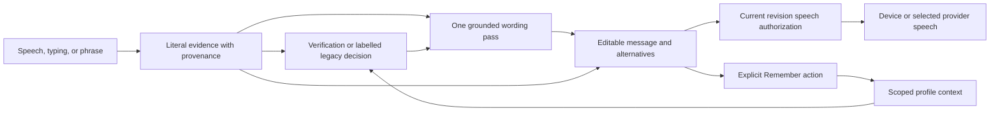

# Echora

**A communication assistant that keeps uncertain speech evidence visible while helping a speaker choose and say a message.**

Echora explores communication support for people with difficult-to-understand speech, including stroke survivors. It combines an adapted speech recognizer, constrained message composition, optional personal context, and web/native clients. Its central engineering problem is preserving the speaker's words when a fluent rewrite could conceal a recognition error.

This is a personal research and application prototype. It contains measured ASR experiments and tested interaction contracts; it does not establish clinical benefit or accessibility suitability for an individual.

[Architecture](docs/architecture.md) · [Evaluation](docs/evaluation.md) · [Decisions](docs/adr/README.md) · [Run locally](docs/reproducibility.md) · [Failures](docs/failure-analysis.md)

## Why this is difficult

- **The right words may be missing.** Multiple decoder hypotheses expose alternatives but cannot recover a phrase absent from every beam.
- **Fluency can hide mistakes.** Generated wording must retain literal sources and meaningful alternatives, including negation, names, and quantities.
- **Context can contradict current speech.** Habitual preferences are weak, scoped evidence; explicit current words take precedence.
- **Late responses can speak an old message.** Edits, Stop, new work, and context changes must revoke pending playback across both clients.
- **Small datasets limit conclusions.** Speaker holdouts, repeated prompts, synthetic commands, and ordinary-speech retention measure different things.

## Evidence at a glance

These are separate experiments, not one leaderboard. WER is word error rate; lower is better.

| Experiment | Baseline | Result | Interpretation |
| --- | --- | --- | --- |
| Foundation screen, 400 utterances / eight speakers | Parakeet: 45.83% speaker-macro WER | Qwen: 41.90% | Supported foundation selection; not final validation |
| Command-v3 protected composed-command test | Previous adapter: 72.58% WER | v3: 51.58% | Controlled compositions, not naturally spoken commands |
| Command-v3 normal-speech retention | 5.23% WER | 5.23% | Retention on this test |
| Three personal recordings | Previous adapter: 22.22% WER | v3: 44.44% | A real regression |
| Later verifier, M04 | ASR: 52.62% WER | Fusion: 52.33% | Paired interval crosses zero; improvement not established |

The separate five-beam command diagnostic finds the exact reference somewhere in the beams for **36.46%** of utterances. This is oracle coverage, not automatic-selection accuracy. The learned verifier's acceptance audit failed its minimum evidence requirement, so **learned automatic selection remains disabled**. [Sources and protocol differences →](docs/evaluation.md)

## Interface


*Actual application capture with an isolated demonstration store and cloud keys disabled. The recognizer selector exposes the chosen route; recording and typed input are distinct actions. [Typed-message view and walkthrough](docs/demo.md).*

## How it works



The local adapted English route separates acoustic verification from generated-candidate count. Missing or insufficiently validated verifier artifacts request a choice. A resolved completed suggestion may speak automatically; choosing an alternative speaks those exact displayed words. Internal confirmation binds playback to the current revision without adding a user step. Stop, edits, and new work invalidate it; restoring a session never replays old speech.

All distinct literal beams remain selectable. A visible follow-up reference lasts at most ten minutes in the same context. Only **Remember this message** persists exact wording to the selected profile. Remembered wording is not acoustic training truth.

The web client includes Hindi/Hinglish wording, delivery controls, and optional experimental camera/gaze features. Expo shares the backend lifecycle with fewer optional controls. [Interaction and data boundaries →](docs/architecture.md)

## Inspect or run

Recompute the foundation comparison from checked-in predictions and summarize saved adapter results without models, keys, or audio:

```sh
git clone https://github.com/sethanimesh/echora.git
cd echora
python3 scripts/reproduce_results.py
```

This verifies saved evidence; it does not rerun inference or training. For the application, use an Apple Silicon Mac, Python 3.12–3.14, Node 22.13+, FFmpeg, and the verified model bundle:

```sh
cp .env.example .env
# Provision the model bundle and provider settings; see the guide below.
./scripts/setup_local.sh
./scripts/dev.sh
```

Open `http://localhost:3000`; the shared API runs on 8000. **Weights, recordings, and private profiles are excluded from Git.** Setup verifies the bundle but does not download it. [Complete prerequisites and reproduction boundaries →](docs/reproducibility.md)

[Demo walkthrough](docs/demo.md) covers typed input, editing, speech and Stop. Automated checks do not establish audible speech quality, microphone recognition, or gaze accuracy.

## Tests

```sh
.venv/bin/python scripts/check_unified.py research/benchmarks/tests research/training/tests
npm --prefix frontend test
npm --prefix frontend run typecheck
npm --prefix frontend run build
npm --prefix mobile test
```

The Python runner isolates personal storage and blocks external connections. CI is configured to run these contracts and client checks without provider credentials. [Testing scope →](docs/reproducibility.md#testing)

## Repository guide

| Area | Purpose |
| --- | --- |
| [backend/](backend/) | Recognition, grounding, verification and native bridge |
| [communication/backend/](communication/backend/) | Shared lifecycle, profiles, language and delivery |
| [frontend/](frontend/) / [mobile/](mobile/) | Web and Expo clients |
| [research/](research/) | Training, baselines, benchmarks and saved results |
| [models/](models/) | Artifact identities, configurations, checksums and reports |
| [docs/README.md](docs/README.md) | Methodology, decisions, failures and open questions |

Groq, Fish, optional Gemini, and remote recognition receive the inputs required by their selected features. Profiles use local SQLite. Tagged coordinates are stored through the local API and matched in the client. This is a local-first application with optional cloud providers. [Configuration and data →](docs/local-development.md#configuration-and-data)

See the [development record](docs/development-history.md) for the preserved chronology and [contributions](docs/contributions.md) for upstream components and attribution boundaries.
