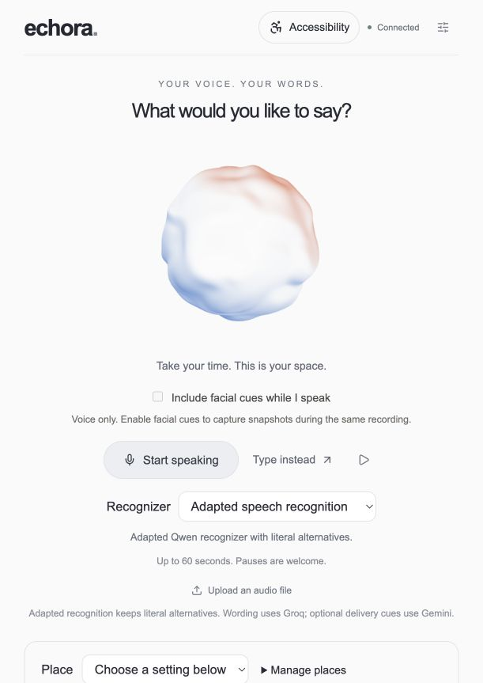
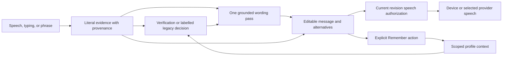

# Echora: Literal ASR Adapter for Dysarthric Composed Commands

An adapter over `Qwen/Qwen3-ASR-1.7B-hf` delivering **literal transcription for composed dysarthric commands** with 5-beam hypothesis preservation.

## Why This Adapter

| Challenge | Our Approach |
| --- | --- |
| **Right words may be missing** | Emit 5 literal hypotheses — speaker sees what model actually heard |
| **Fluency can hide mistakes** | Immutable evidence + application-layer grounding preserves alternatives |
| **Small datasets limit conclusions** | Speaker-disjoint folds, controlled compositions, transparent overlap disclosure |

## Evidence at a Glance

Separate experiments, not one leaderboard. WER = word error rate (lower is better).

| Experiment | Data | Baseline | Result | Interpretation |
| --- | --- | --- | --- | --- |
| Foundation screen | 400 utt / 8 speakers | Parakeet: 45.83% speaker-macro WER | Qwen: 41.90% | Foundation selection supported |
| **Command-v3 composed commands** | **M04 holdout (480 utt)** | **v1: 72.58% WER** | **v3: 51.58% WER** | **−21.00 pts on target task** |
| **Top-5 exact coverage (5-beam)** | **M04 holdout** | **v1: 16.04%** | **v3: 36.46%** | **+20.42 pts — alternatives preserved** |
| Normal speech retention | 262 utt | 5.23% WER | 5.23% WER | Retention maintained |
| Personal clips (target user) | 3 utt | v1: 22.22% WER | v3: 44.44% WER | Known domain gap (n=3) |

**The learned verifier pipeline** (acoustic reranking + context fusion) is documented in the [Technical Appendix](docs/technical-appendix/pipeline-evaluation.md). Its acceptance audit did not meet the minimum evidence threshold; the adapter release focuses on the validated literal transcription capability.

[Sources and protocol differences →](docs/evaluation.md)

## Critical Limitations

| Limitation | Detail |
|------------|--------|
| **Speakers** | Only **8 dysarthric speakers** (TORGO) across all folds |
| **Task** | Results on **composed commands** (stitched isolated words), not natural speech |
| **Test overlap** | Held-out speaker M04 shares 227/229 prompt groups with training |
| **No clinical validation** | No participant study, IRB, or SLP assessment |

## Interface



*Screenshot using **synthetic typed input** (not speech recognition), isolated demonstration profile store, and all cloud provider keys disabled. [Demo walkthrough](docs/demo.md) — does not demonstrate recognition quality or audible playback.*

## How It Works



The local adapted English route separates acoustic verification from generated-candidate count. Missing or insufficiently validated verifier artifacts request a choice. A resolved completed suggestion may speak automatically; choosing an alternative speaks those exact displayed words. Internal confirmation binds playback to the current revision without adding a user step. Stop, edits, and new work invalidate it; restoring a session never replays old speech.

All distinct literal beams remain selectable. A visible follow-up reference lasts at most ten minutes in the same context. Only **Remember this message** persists exact wording to the selected profile. Remembered wording is not acoustic training truth.

The web client includes Hindi/Hinglish wording, delivery controls, and optional experimental camera/gaze features. Expo shares the backend lifecycle with fewer optional controls. [Interaction and data boundaries →](docs/architecture.md)

## Inspect or Run

Recompute the foundation comparison from checked-in predictions and summarize saved adapter results without models, keys, or audio:

```sh
git clone https://github.com/sethanimesh/echora.git
cd echora
python3 scripts/reproduce_results.py
```

This verifies **saved predictions only** — it does not rerun inference, retrain the adapter, or download models/audio. For the application, use an Apple Silicon Mac, Python 3.12–3.14, Node 22.13+, FFmpeg, and the verified model bundle:

```sh
cp .env.example .env
# Provision the model bundle and provider settings; see the guide below.
./scripts/setup_local.sh
./scripts/dev.sh
```

Open `http://localhost:3000`; the shared API runs on 8000. **Weights, recordings, and private profiles are excluded from Git.** Setup verifies the bundle but does not download it. [Complete prerequisites and reproduction boundaries →](docs/reproducibility.md)

[Demo walkthrough](docs/demo.md) covers typed input, editing, speech and Stop. Automated checks do not establish audible speech quality, microphone recognition, or gaze accuracy.

## Tests

```sh
.venv/bin/python scripts/check_unified.py research/benchmarks/tests research/training/tests
npm --prefix frontend test
npm --prefix frontend run typecheck
npm --prefix frontend run build
npm --prefix mobile test
```

The Python runner isolates personal storage and blocks external connections. CI is configured to run these contracts and client checks without provider credentials. [Testing scope →](docs/reproducibility.md#testing)

## Repository Guide

| Area | Purpose |
| --- | --- |
| [backend/](backend/) | Recognition, grounding, verification and native bridge |
| [communication/backend/](communication/backend/) | Shared lifecycle, profiles, language and delivery |
| [frontend/](frontend/) / [mobile/](mobile/) | Web and Expo clients |
| [research/](research/) | Training, baselines, benchmarks and saved results |
| [models/](models/) | Artifact identities, configurations, checksums and reports |
| [docs/README.md](docs/README.md) | Methodology, decisions, and open questions |
| [docs/technical-appendix/](docs/technical-appendix/) | Pipeline experiments, failure analysis, learning artifacts |

Groq, Fish, optional Gemini, and remote recognition receive the inputs required by their selected features. Profiles use local SQLite. Tagged coordinates are stored through the local API and matched in the client. This is a local-first application with optional cloud providers. [Configuration and data →](docs/local-development.md#configuration-and-data)

See the [development record](docs/development-history.md) for the preserved chronology and [contributions](docs/contributions.md) for upstream components and attribution boundaries.

The public repository retains training code, evaluation predictions, model identities, design decisions, contract tests, and documented failures. Personal recordings, transcript sidecars, individual facial-trial exports, and local audit originals stay in ignored storage. Published personal smoke-test results use stable recording aliases; their literal wording and measurements are preserved. See [research evidence boundaries](research/README.md#public-evidence-and-private-inputs).
