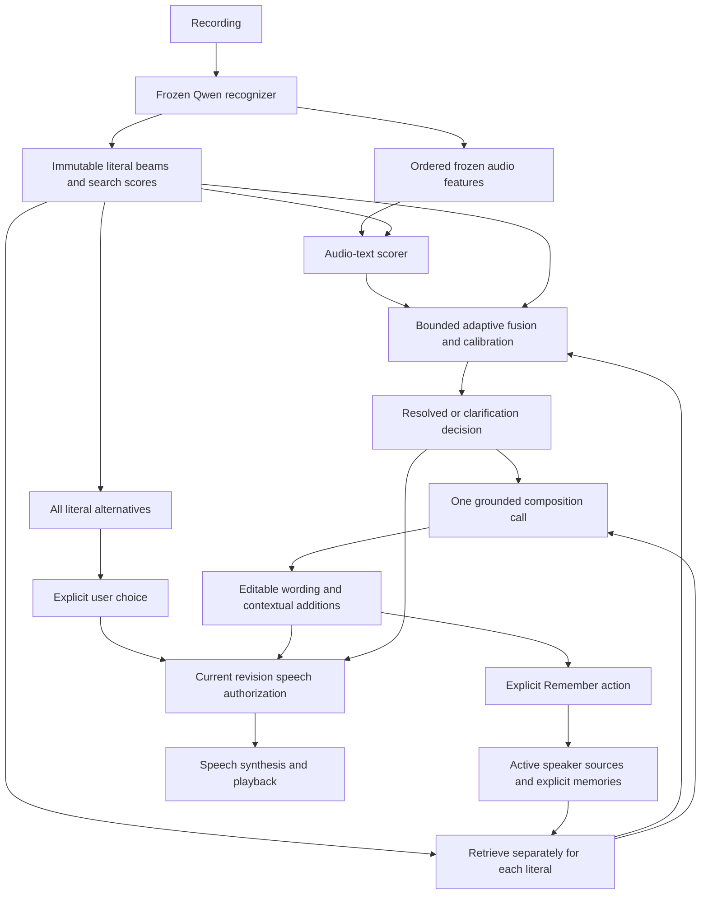

# Unified application architecture

`app.main` is the single composition root. Its lifespan loads the configured recognition runtime once and attaches that runtime to `communication.backend.app`. The communication service runs inside the same process. `scripts/dev.sh` serves that API on 8000 and the React/Vinext web app on 3000, with an API proxy. An optional independent loopback gaze service uses 8767.

## Input, evidence, and wording

Recordings select either the adapted recognizer or Whisper. Adapted recognition returns every literal hypothesis and its genuine search scores. Whisper returns one literal transcript without fabricated beam scores. Typed and phrase input have user provenance. Recognition evidence is retained separately from suggested and edited text.

`communication/backend/recognition.py` bridges adapted evidence to the existing grounded composition chain. Local five-beam recognition optionally scores frozen audio features with a separate audio–text verifier and retrieves profile-scoped context before bounded fusion. The job's `ranking` and `retrieval` traces remain separate from immutable `evidence`. The learned route constrains composition to complete permitted beams; it never gives a mixed reading an acoustic score. Other routes expose honest unsupported diagnostics and retain their legacy decisions. Each candidate carries its reading, display text, source literal text and IDs, optional approved detail expansions, and plain wording. All distinct literal beams remain selectable outside the three-option expansion limit.

Grounding preserves meaningful alternatives, including negation. Bounded checks cover unsupported body parts, laterality, substances, drugs, quantities and negation. These checks are not a general proof of semantic fidelity, and translation does not have the same English vocabulary guard. Legacy recognition routes retain their existing surviving-candidate playback rule; learned verification uses the independent decision described below.

## Message lifecycle and speech

Each session owns one current job. A job has a stable ID, increasing revision, original input, evidence, candidates, editable text, frozen context, optional clarification, and prepared/confirmed speech. Mutations require the current revision. New jobs and cancellation invalidate work and audio from earlier jobs.

The user selected immediate speech: a resolved completed recommendation is marked for speech; tapping an alternative marks that selected revision. On the verification route, the machine decision and recommended candidate ID control arrival speech independently of candidate count. A single generated option cannot override unresolved acoustic evidence, and a failed selected expansion cannot be replaced by a rival. Missing or unvalidated artifacts leave learned resolution disabled. Unresolved clarification and failed raw recognition arrival remain silent. An explicit selection of a raw alternative speaks those literal words without another wording call. Manual edits require Speak. The autoplay configuration can suppress arrival speech while leaving explicit actions working.

Confirmation is internal authorization for exact text, pronunciation and delivery, not another required user-facing approval step. The web client only auto-speaks a revision associated with an active local operation; restored sessions and event reconnections do not replay results. Cancellation guards cover preparation, synthesis, and device playback callbacks. The native client uses the same revision contract. Profile, recipient and conversation-reference changes revoke a machine decision made under the old context; an explicit user choice remains a separate authorization. Web events revoke pending playback, and the native client observes cross-session invalidation on a 500 ms polling interval subject to network delay.

Stopping a request revokes its result immediately. A PyTorch worker already running keeps the model lock until it finishes, so later recordings cannot overlap that model call. Unused MPS buffers are released after local recognition; this housekeeping does not change audio, decoding settings or evidence.

Display text and pronunciation text remain separate. Device and Fish speech are available on web; native retains Groq and device speech. Cloud provider limits cannot truncate the displayed message silently. Groq's 200-character bound falls back to the full message through device speech. Optional voice/facial suggestions affect delivery, not literal evidence or message meaning.

## Context, profiles, and short follow-ups

A single versioned SQLite profile store combines lexicon entries, scoped specializations, audiences, styles, protected names, use/ask rules, language preferences, and saved exact-message cues. Migration prefixes source IDs and inserts missing profiles without overwriting edits or deleting source stores. The native profile adapter preserves fields its UI cannot edit.

Each job freezes profile data/revision, setting, place, and audience. Adapted recognition resolves listeners in order: explicit audience, place declaration, profile setting default, setting default. Missing declarations remain missing. Scenarios such as café and shopping coexist with the recognizer's four broad settings. Explicit qualifiers, negation, and clarification answers outrank habitual details.

The last approved message is kept in session memory for at most 600 seconds and can supply an antecedent only for narrow follow-ups in the same context. It is visible and can be cleared. Profile revision, scope, place/audience and explicit independent-message choices constrain reuse. Restart or session expiry clears it.

Persistent retrieval is a separate, explicitly controlled store in the same SQLite database. Profile sources and chunked MiniLM embeddings are scoped by speaker and source revision. Only Remember stores the exact displayed message; internal speech confirmation is not storage consent. A separate memory revision prevents saves from invalidating profile editors. Deletion cascades vectors and invalidates dependent jobs, prepared audio and temporary references. Remembered messages never become acoustic training labels. The first semantic index is English-only; other language records remain manageable without automatic translation. See [verification and memory](verification-and-memory.md).

Named places remain in the local JSON settings store. Tagged coordinates are sent to that local API for storage; client-side location matching chooses among those saved places. Coordinates are not included in recognition/composition requests.

## Clients and boundaries

Browser communication routes use a loopback host/origin boundary, an HTTP-only session cookie and an application header on mutations. The native bridge under `/api/v1/communication` translates an opaque session header into the same in-process workflow and bounds accepted origins. A native device needs a deliberately LAN-bound backend. This remains a personal development application, not a production multi-user service.

Legacy `/api/v1` recognition/profile routes remain for compatibility and research tooling. Both current clients use the shared communication lifecycle. Remote GPU workers still only return raw ASR and do not receive the wording provider key.

The root `.env` configures providers. Text/audio required by an explicitly used cloud feature goes to that provider. The optional gaze service processes browser frames locally in memory. Web accessibility and delivery controls share camera ownership; those browser features have not been ported to Expo.

The reusable `echora` language package imports the one core under `communication.backend.hinglish_core`. CLI and optional Haystack integrations are retained separately from the communication app's runtime path.
