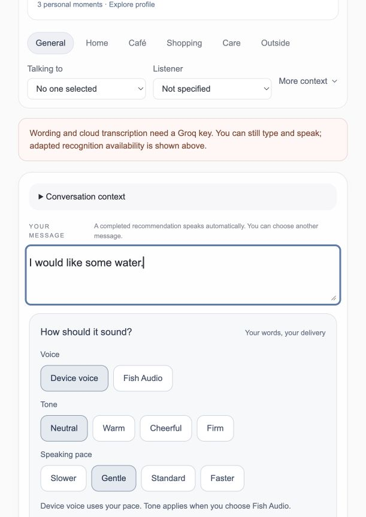

# Demonstration walkthrough

Use synthetic text and a demonstration profile. A live demonstration should make the input, editable output and control state visible. Never present a mock transcript as a measured recognition result.

## Captured implementation

*Captured on 28 September 2026 from the running app, using an isolated profile store with provider keys disabled. The text was typed for this demonstration, not recognized from audio. Voice and pace are separate from editable wording. The visible provider notice explains which features are unavailable. No microphone or camera was opened and no speech-quality claim is made.*

## Typed-message lifecycle

1. Start the app using [reproducibility](reproducibility.md), then open `http://localhost:3000`.
2. Enter a synthetic message such as “I would like some water.” Confirm the interface identifies typed input.
3. Edit the displayed words. Use Speak to request the edited text; demonstrate Stop during a sufficiently long message.
4. Refresh or reconnect. The previous result must not speak automatically.
5. If using a demonstration profile, choose Remember explicitly, inspect the saved wording, then delete it. Ordinary speech must not save it automatically.

This demonstrates UI and lifecycle behavior. It does not test recognition quality or prove audible playback quality from screenshots alone.

## Speech evidence walkthrough

With the verified model and a permitted test recording, show literal alternatives alongside suggested wording. Explain that search weights are not confidence and that all alternatives remain selectable. On the current local learned route, failed acceptance keeps the result asking for a choice. Selecting a literal alternative should speak its exact words.

Use the [I water failure](failure-analysis.md) to discuss a recorded failure without presenting the reference as a successful recognition.

## Capture scope

Screenshots, when included, are actual running application states. A live microphone-to-speech demonstration and participant usability study remain separate tasks; automated contracts do not substitute for them.
